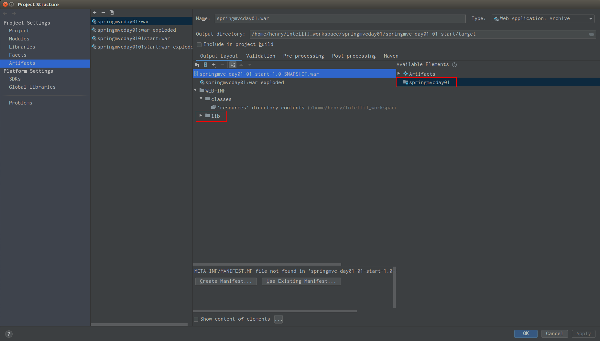
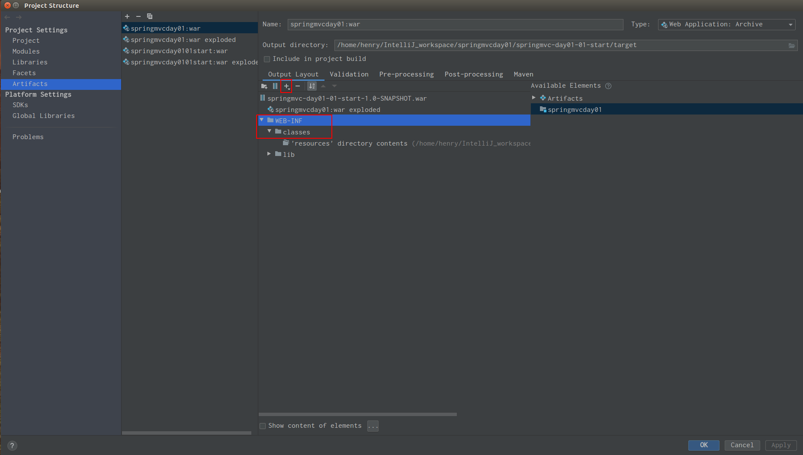

## SpringMVC学习的第二天

### 一、问题

- 1. 这个问题真的很傻。

**问题描述**： 首先，一个SpringMVC项目的流程，就是首先根据web.xml文件中的配置，创建一个DispatchServlet对象；然后根据配置，就是在web
web.xml文件中，配置一个<init-param>classpath: ××××.xml</init-param>。这里一般就是那个springmvc的配置文件，并且要配置，在启动Servlet的时候就自动去加载。然后在.xml文件中继续配置，首先要配置注解的路径，就是要给出路径，告诉去哪里找到注解（@Controller这一类的注解）。然后，因为一般的Controller返回的是个String，然后配置一个<bean></bean>，里面写上<peoperty></property>，然后去配置前缀，一般情况下的前缀（prefix），就是路径，“/WEB-INF/pages”；然后配置后缀（suffix），后缀一般都是“.jsp”。然后在开启 <mvc:annotions-driven>。

这样进行了配置了以后，在运行项目的时候，报错，找不到 ××××.xml 文件。首先呢，这个.xml配置文件，在resources文件夹下。无论怎么去改写classpath后面的这个值，都报错找不到。项目运行的时候，报的错是 ClassNotFoundException这个异常。 这个问题的根本原因是，在程序编译的时候找不到制定的 ××××.xml 文件。那也就是说，在编译的时候，并没有到 src/main/resources 下去找到这个文件。

然后，解决问题的方法。

- 1. `点击 File->Project Structure`
  
  `如下图所示，邮件点击右边的红框，就会出现一个 Put Into Output Root 的选项，选择之后，就会在左边，自动生成一个 lib 文件夹。`
  
  

- 2. `然后右键点击下图中的 WEB-INF 文件夹，选择新建一个目录，叫做 classes。选中 classes 这个包后，然后再点击上面的加号。在加号中选择添加一个 Directory Content 。然后找到相应的 resources 包，添加进去。`

- 3. 至此，这个问题就得到了完美的解决。
